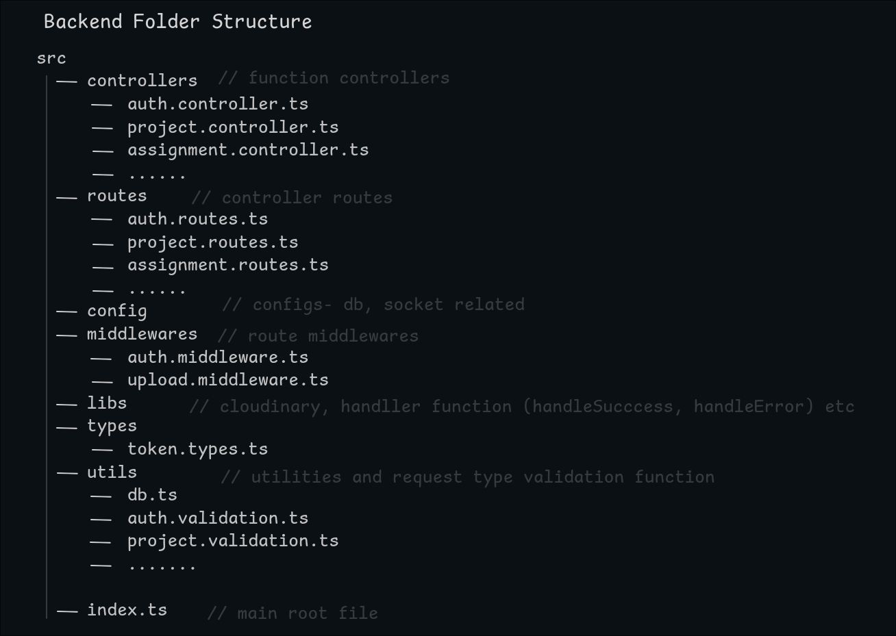

# RBAC Dashboard Backend

Welcome to the backend for the Role-Based Access Control (RBAC) Dashboard application! This server handles all things authentication, role based checks, projects, assignments, tasks, and analytics.

---

## Tech Stack

Here is the tech stack used to build this backend:

- **Node.js & Express**: Runs the server and handles API requests
- **TypeScript**: Provides type safety for less type bugs
- **PostgreSQL**: Used for better reliable relational database over prisma
- **Prisma**: The ORM used to write queries and manage database migrations easily
- **Zod**: Used to validate incoming request for exact data control
- **JSON Web Tokens (JWT)**: Handles secure authentication
- **Cloudinary**: For cloud storage of uploaded project images and task attachments
- **Multer**: Handles file uploads on Express routes

---

## Backend Folder Structure

Here is a visual map of the backend project directory structure:



## Getting Started

To run this project locally, make sure to install Node.js and PostgreSQL first

### 1. Configure environment variables

Create a `.env` file inside the `/server` directory and add the following keys:

```env
PORT=5000
POSTGRES_PRISMA_URL="your-postgresql-connection-string"
JWT_ACCESS_SECRET="your-access-token-secret"
JWT_REFRESH_SECRET="your-refresh-token-secret"
CLOUDINARY_CLOUD_NAME="your-cloudinary-cloud-name"
CLOUDINARY_API_KEY="your-cloudinary-api-key"
CLOUDINARY_API_SECRET="your-cloudinary-api-secret"
```

### 2. Install dependencies

```bash
npm install
```

### 3. Generate Prisma client and run migrations

```bash
npx prisma migrate dev
npx prisma generate
```

### 4. Start the server

```bash
npm run dev
```

The server will be running at [http://localhost:5000](http://localhost:5000)
